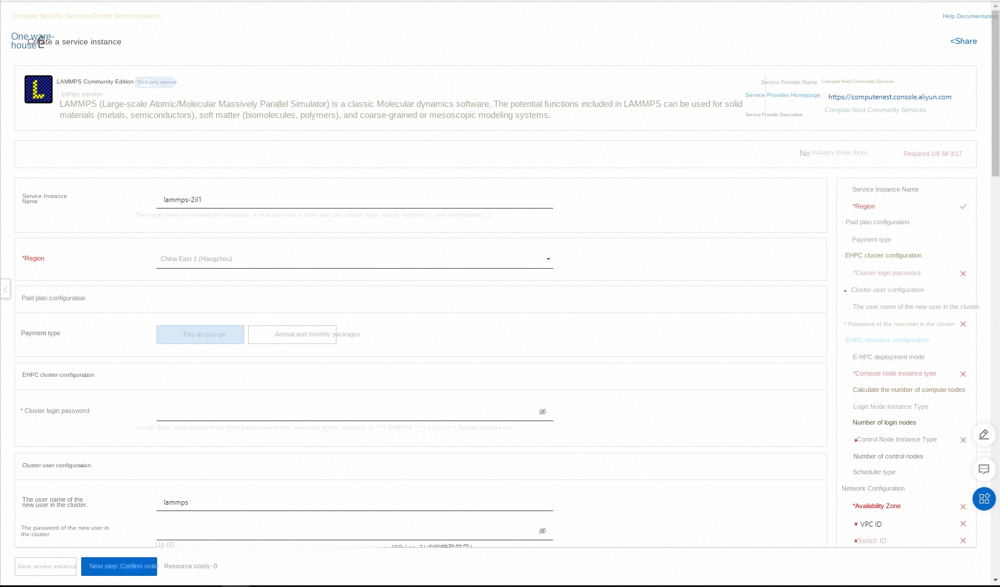
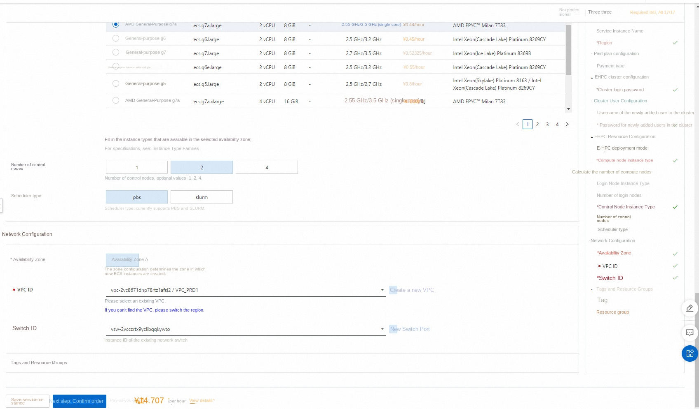
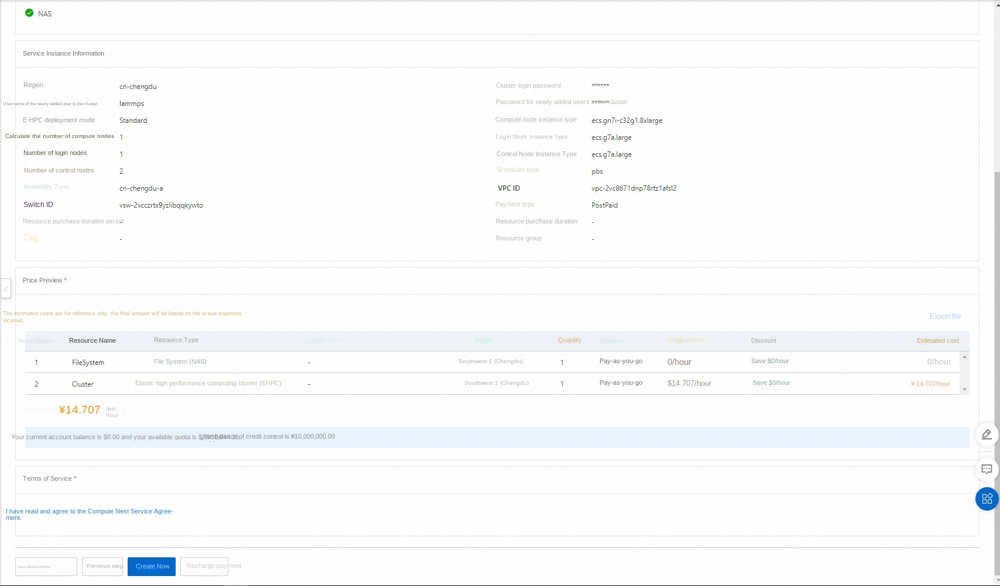
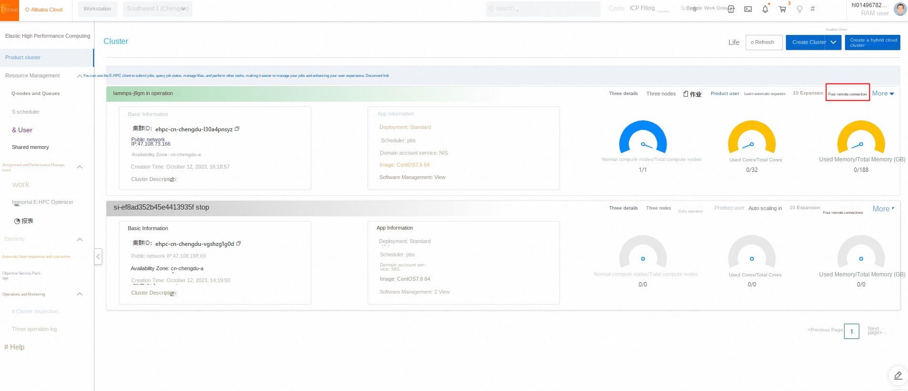
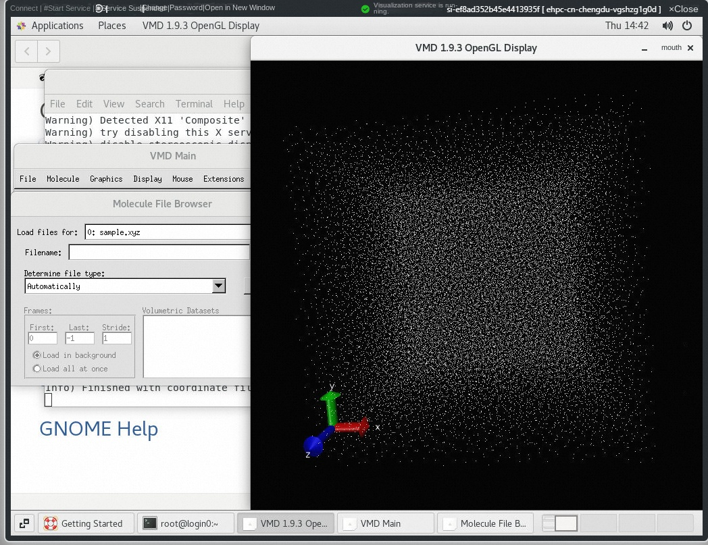

# LAMMPS Ehpc computing nest rapid deployment

> **Disclaimer:** This service is provided by a third party. We try our best to ensure its safety, accuracy and reliability, but we cannot guarantee that it is completely free from failures, interruptions, errors or attacks. Therefore, the company hereby declares that it makes no representations, warranties or commitments regarding the content, accuracy, completeness, reliability, suitability and timeliness of the Service and is not liable for any direct or indirect loss or damage arising from your use of the Service; for third-party websites, applications, products and services that you access through the Service, do not assume any responsibility for its content, accuracy, completeness, reliability, applicability and timeliness, and you shall bear the risks and responsibilities of the consequences of use; for any loss or damage arising from your use of this service, including but not limited to direct loss, indirect loss, loss of profits, loss of goodwill, loss of data or other economic losses, even if we have been advised in advance of the possibility of such loss or damage; we reserve the right to amend this statement from time to time, so please check this statement regularly before using the Service. If you have any questions or concerns about this Statement or the Service, please contact us.

## Overview

LAMMPS(Large-scale Atomic/Molecular Massively Parallel Simulator) is a classic molecular dynamics software. LAMMPS contains potential functions that can be used in solid materials (metals, semiconductors), soft matter (biomacromolecules, polymers), coarse-grained or mesoscale model systems.
## Prerequisites

To deploy a LAMMPS community edition service instance, you need to access and create some Alibaba Cloud resources. Therefore, your account must contain permissions for the following resources.
**Note**: This permission is required only when your account is a RAM account.

| Permission policy name | Comment |
| ------------------------------------- | -------------------- |
| AliyunECSFullAccess | Permissions to manage ECS instances |
| AliyunVPCFullAccess | Permissions to manage a VPC |
| AliyunROSFullAccess | Manage permissions for Resource Orchestration Service (ROS) |
| AliyunEHPCFullAccess | Manage permissions for Elastic High Performance Computing (EHPC) |
| AliyunNASFullAccess | Manage NAS permissions |
| AliyunComputeNestUserFullAccess | Manage user-side permissions for the compute nest service (ComputeNest) |

## Billing Description

The cost of LAMMPS Community Edition deployment in Computing Nest mainly involves:

-Elastic High Performance Computing Cluster (EHPC) fees
-File system (NAS) fees
-Traffic bandwidth charges

## Deployment Architecture

-deployment consists of an ehpc cluster, which includes manager nodes, schedule nodes, and compute nodes
-The service uses nas-cpfs to build a high-performance shared file system

## Parameter description
| Parameter group | Parameter item | Description |
| ----------- | -------------- | -------------------------------------------------------- |
| Service Instance | Service Instance Name | The service instance name must be no more than 64 characters in length and must start with an English letter. It can contain numbers, English letters, dashes (-), and underscores (_). |
| | Region | The region where the service instance is deployed |
| | Billing Type | Billing type of the resource: Pay-As-You-Go and Subscription |
| EHPC Cluster Configuration | Cluster Login Password | 8-30 in length and must contain three items (uppercase letters, lowercase letters, numbers, ()'~!@#$%^& *-+ =|{}[]:;' <>,.?/special symbols) |
| | Ehpc Deployment Modes | Tiny,Simple,Standard |
| | Computing node instance type | Computing node specifications available in the zone |
| | Number of compute nodes | Number of compute nodes, optional value: 1-99 |
| | Logon node instance type | Logon node specifications available in the zone |
| | Number of control nodes | Number of control nodes, optional values: 1,2,4 |
| EHPC Cluster User Configuration | The user password | is 8-30 in length and must contain three items (uppercase letters, lowercase letters, numbers, ()~!@#$%^& *-_+ =\ |{}[]:;'/<>,.?/special symbols) |
| | User name | The user name used to log on to the cluster. The default value is lammps. |
| Network Configuration | Availability Zone | The zone where the ECS instance is located |
| | VPC ID | The VPC where the resource resides |
| | VSwitch ID | VSwitch where the resource resides |

## Deployment process
1. Visit Computing Nest LAMMPS Community Edition [Deployment Link](https://computenest.console.aliyun.com/user/cn-hangzhou/serviceInstanceCreate?&ServiceId=service-199f5aeaf0f142918076)
, fill in the deployment parameters as prompted:

2. After completing the parameters, you can see the corresponding RFQ details. After confirming the parameters, click **Next: Confirm Order**.

3. Confirm the order and agree to the service agreement and click **Create Now**
Enter the deployment phase.

## Use process
### Step 1: Connect to the cluster through the console
1. Log on to the [Elastic High Performance Computing Console](https://ehpc.console.aliyun.com).
2. In the top-left corner of the menu bar, select a region.
3. In the left-side navigation pane, click **Clusters**.
4. On the **Clusters** page, find the target cluster deployed in the computing nest and click **Remote Connection**.

5. On the **Remote Connection** page, enter the cluster username, login password, and port number, and click **ssh Connection**.

### **Step 2: Submit a Job**

This article describes how to use the E-HPC cluster to run LAMMPS open source simulation software, to 3d Lennard-Jones melt model for industrial simulation, and through the visual way to view the simulation results.

1. Execute the following command to create a study file named lj.in.

'''
vim lj.in
'''

Example job script content is as follows:

'''
# 3d Lennard-Jones melt
variable x index 1
variable y index 1
variable z index 1

variable xx equal 20*$x
variable yy equal 20*$y
variable zz equal 20*$z

units lj
atom_style atomic

lattice fcc 0.8442
region box block 0 ${xx} 0 ${yy} 0 ${zz}
create_box 1 box
create_atoms 1 box
mass 1 1.0

velocity all create 1.44 87287 loop geom

pair_style lj/cut 2.5
pair_coeff 1 1 1.0 1.0 2.5

neighbor 0.3 bin
neigh_modify delay 0 every 20 check no

fix 1 all nve
dump 1 all xyz 100 sample.xyz
run 10000
'''

2. Run the following command to create a job script file. The script file is named lammps.pbs.

'''
vim lammps.pbs
'''

> The following example uses 32 vCPUs on one compute node and 32 MPI tasks for high-performance computing. Please configure the number of vCPUs based on the actual computing node specifications, and the computing power must be vCPU≥ 32.

Example job script content is as follows:

'''
#! /bin/sh
#PBS -l select=1:ncpus=32:mpiprocs=32
#PBS -j oe

export MODULEPATH =/opt/ehpcmodulefiles/# environment variables on which the module command depends
module load lammps-openmpi/31Mar17
module load openmpi/1.10.7

echo "run at the beginning"
mpirun lmp -in ./lj.in# Please modify the path of the lj.in file according to the actual situation
'''

3. Execute the following command to submit the job.

'''
qsub lammps.pbs
'''

The expected return is as follows, indicating that the generated job ID is scheduler.

'''
0.scheduler
'''

### **Step 3: View Job Results**

1. Check the operation of the job.

'''
cat lammps.pbs.o0
'''

> If you do not specify the job standard output path, the output file is generated according to the scheduler behavior by default. The default job result file output is/home/<user name>/directory. The job result file in this example is/home/testuser/lammps.pbs.o0.

The expected return is as follows:

'''
......
Per MPI rank memory allocation (min/avg/max) = 3.777 | 3.801 | 3.818 Mbytes
Step Temp E_pair E_mol TotEng Press
0 1.44 -6.7733681 0 -4.6134356 -5.0197073
10000 0.69814375 -5.6683212 0 -4.6211383 0.75227555
Loop time of 9.81493 on 32 procs for 10000 steps with 32000 atoms

Performance: 440145.641 tau/day, 1018.856 timesteps/s
97.0% CPU use with 32 MPI tasks x no OpenMP threads

MPI task timing breakdown:
|Section | min time | avg time | max time |%varavg| %total
|---------------------------------------------------------------
|Pair | 6.0055 | 6.1975 | 6.3645 | 4.0 | 63.14
|Neigh | 0.90095 | 0.91322 | 0.92938 | 0.9 | 9.30
|Comm | 2.1457 | 2.3105 | 2.4945 | 6.9 | 23.54
|Output | 0.16934 | 0.1998 | 0.23357 | 4.3 | 2.04
|Modify | 0.1259 | 0.13028 | 0.13602 | 0.8 | 1.33
|Other | | 0.06364 | | | 0.65

Nlocal: 1000 ave 1022 max 986 min
Histogram: 5 3 6 3 4 4 2 2 1 2
Nghost: 2705.62 ave 2733 max 2668 min
Histogram: 1 1 0 3 7 5 4 5 4 2
Neighs: 37505 ave 38906 max 36560 min
Histogram: 7 3 2 4 5 2 3 3 2 1

Total # of neighbors = 1200161
Ave neighs/atom = 37.505
Neighbor list builds = 500
Dangerous builds not checked
Total wall time: 0:00:10
'''

2. Use VNC to visualize the job results.
1. Open VNC. The system automatically opens the cluster security group 12016 port during console operations.
1. In the left-side navigation pane of the HPC console (https://ehpc.console.aliyun.com), click **Clusters**.
2. On the **Clusters** page, find the target cluster and click **More**> **VNC**.
3. Use VNC remote connection visualization service. For more information, see [Connect Visualization Service](https://help.aliyun.com/zh/e-hpc/user-guide/use-vnc-to-manage-a-visualization-service#section-bf6-eyn-edu).
2. In the VNC window, choose Application>System Tools>Terminal.
3. Run '/opt/vmd/1.9.3/vmd' to open the VMD software.
4. In the VMD Main dialog box, select **File > New Molecule...**.
5. Click **Browse...** in the **Filename** section and select the sample.xyz file.
6. The sample.xyz file is located in the path/home/{user name}/sample.xyz.
7. Click **Load** to view the visualization results in the **VMD 1.9.3 OpenGL Display** window.

